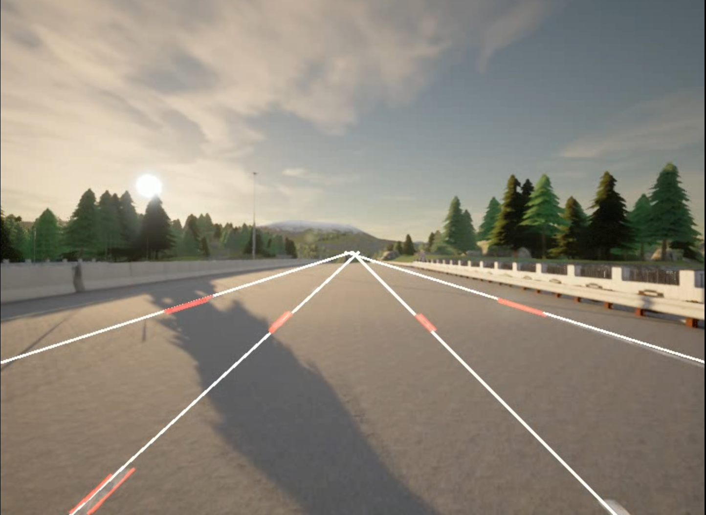

# Carla Simulator- Rule based auto-pilot driving 

## Final video

## Procedure

### Lane detection
* Attached camera sensor to the vehicle.
* Modified camera sensor image to cv2 format.
* Used hough transform to detect lines in each image.
* Classified lane from non-lane by vanishing point of each line.
  

## Limitations
* The simulator got so slow when I started to use the camera sensor. So I couldn't progress the project further.
* The reason of the slow speed is limitation of my laptop's hardware and Python.

## What I've learned
* Implementing auto-pilot driving in the simulator wasn't easy. But during this project I've learned how to read and use the API references.
* Reading and using those API references also made my programming skills improved. 
* Python is a great language but slow one. So I've learned the limitation of the Python and also the necessity of a faster language that I can use.

